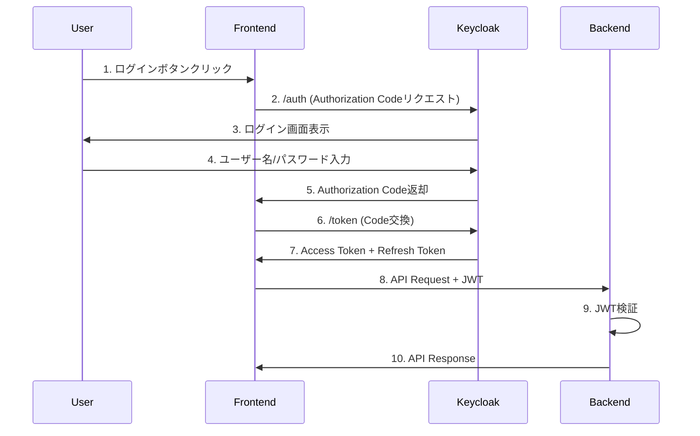
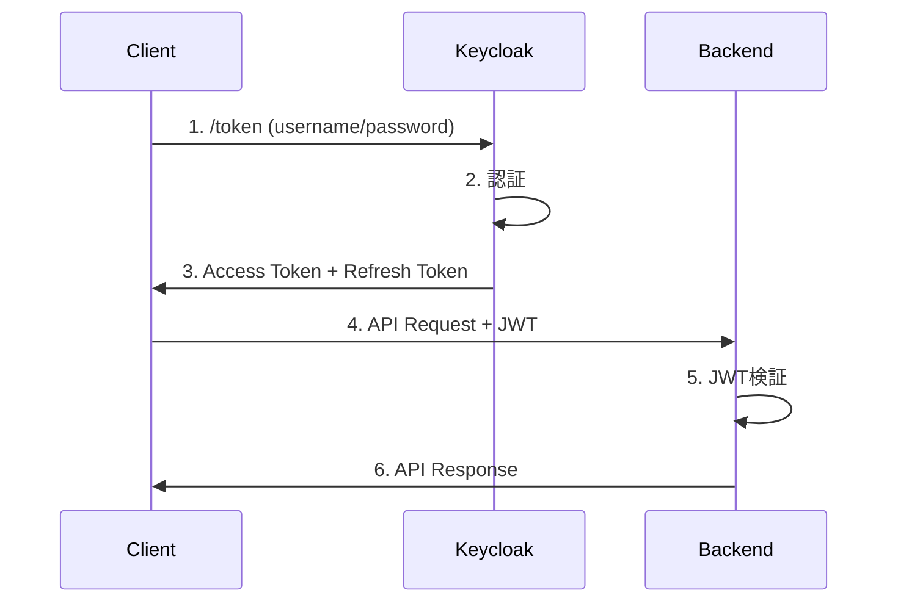

# Keycloak統合ガイド

Auth PlatformとKeycloakの統合方法を説明します。

## 概要

Auth Platformは、認証（Authentication）と認可（Authorization）を分離したアーキテクチャを採用しています：

- **Keycloak (backend_auth)**: 認証・JWTトークン発行を担当
- **Backend (Spring Boot)**: 認可・ポリシー評価を担当

```
┌─────────────┐
│   Frontend  │
│  (Next.js)  │
└──────┬──────┘
       │
       │ 1. Login Request
       ↓
┌─────────────┐
│  Keycloak   │ ← 認証
│backend_auth │
└──────┬──────┘
       │
       │ 2. JWT Token
       ↓
┌─────────────┐
│   Frontend  │
└──────┬──────┘
       │
       │ 3. API Request + JWT
       ↓
┌─────────────┐
│   Backend   │ ← 認可
│(Spring Boot)│
└──────┬──────┘
       │
       │ 4. Policy Check
       ↓
┌─────────────┐
│ OPA / Redis │
└─────────────┘
```

## Phase 1: 基盤構築（完了）

Phase 1では、Keycloakの基本設定を完了しました。

### 実装内容

✅ **Docker Compose設定**
- Keycloakコンテナ（ポート8180）
- PostgreSQL統合
- Health check設定

✅ **Realm設定**
- Realm: `authplatform`
- Client: `auth-platform-backend` (bearer-only)
- Client: `auth-platform-frontend` (public)
- Client Scope: `organization` (organization_id claim)

✅ **テストユーザー**
- testuser@example.com / Password123!
- admin@example.com / Admin123!

### 起動方法

```bash
cd infrastructure
docker compose up -d

# Keycloakが起動するまで待機（約60秒）
curl http://localhost:8180/health/ready
```

### 管理コンソール

**URL**: http://localhost:8180

**認証情報**:
- Username: `admin`
- Password: `admin`

⚠️ **本番環境では強力なパスワードに変更必須**

## Phase 2: JWT統合（今後実装）

Phase 2では、BackendでJWT検証を実装します。

### 実装予定内容

1. **Spring Security OAuth2 Resource Server統合**
   ```gradle
   implementation 'org.springframework.boot:spring-boot-starter-oauth2-resource-server'
   ```

2. **JwtAuthenticationFilter実装**
   - `Authorization: Bearer <token>`ヘッダーからJWT抽出
   - Keycloak公開鍵で署名検証
   - Claimsからユーザー情報抽出

3. **SecurityConfig更新**
   - API Key認証（既存）
   - JWT認証（新規）
   - 両方をサポート（どちらかが成功すれば認証OK）

### 設定ファイル

`backend/src/main/resources/application.yml`にKeycloak設定を追加済み（コメントアウト）：

```yaml
auth-platform:
  keycloak:
    enabled: false  # Phase 2でtrueに変更
    base-url: http://localhost:8180
    realm: authplatform
    issuer-uri: http://localhost:8180/realms/authplatform
    jwk-set-uri: http://localhost:8180/realms/authplatform/protocol/openid-connect/certs
    jwt:
      public-key-cache-ttl: 3600
      clock-skew-seconds: 30
      expected-audience: auth-platform-backend
```

## OIDC Discovery

Keycloakは標準のOIDC Discovery仕様に準拠しています。

### Discovery Document

**URL**: http://localhost:8180/realms/authplatform/.well-known/openid-configuration

```bash
curl http://localhost:8180/realms/authplatform/.well-known/openid-configuration | jq
```

**レスポンス例**:
```json
{
  "issuer": "http://localhost:8180/realms/authplatform",
  "authorization_endpoint": "http://localhost:8180/realms/authplatform/protocol/openid-connect/auth",
  "token_endpoint": "http://localhost:8180/realms/authplatform/protocol/openid-connect/token",
  "userinfo_endpoint": "http://localhost:8180/realms/authplatform/protocol/openid-connect/userinfo",
  "jwks_uri": "http://localhost:8180/realms/authplatform/protocol/openid-connect/certs",
  "grant_types_supported": [
    "authorization_code",
    "refresh_token",
    "password",
    "client_credentials"
  ],
  "response_types_supported": [
    "code",
    "token",
    "id_token",
    "code token",
    "code id_token",
    "token id_token",
    "code token id_token"
  ]
}
```

### JWK Set (公開鍵)

**URL**: http://localhost:8180/realms/authplatform/protocol/openid-connect/certs

```bash
curl http://localhost:8180/realms/authplatform/protocol/openid-connect/certs | jq
```

**レスポンス例**:
```json
{
  "keys": [
    {
      "kid": "abc-123-xyz",
      "kty": "RSA",
      "alg": "RS256",
      "use": "sig",
      "n": "...",
      "e": "AQAB"
    }
  ]
}
```

## トークン取得

### Password Grant (開発・テスト用)

⚠️ **注意**: Password Grantは開発・テスト目的のみ。本番環境では Authorization Code Flowを使用してください。

```bash
curl -X POST http://localhost:8180/realms/authplatform/protocol/openid-connect/token \
  -H "Content-Type: application/x-www-form-urlencoded" \
  -d "client_id=auth-platform-frontend" \
  -d "grant_type=password" \
  -d "username=testuser@example.com" \
  -d "password=Password123!" \
  | jq
```

**レスポンス**:
```json
{
  "access_token": "eyJhbGciOiJSUzI1NiIsInR5cCI6IkpXVCJ9...",
  "expires_in": 900,
  "refresh_expires_in": 604800,
  "refresh_token": "eyJhbGciOiJIUzI1NiIsInR5cCI6IkpXVCJ9...",
  "token_type": "Bearer",
  "not-before-policy": 0,
  "session_state": "...",
  "scope": "email profile organization"
}
```

### トークンリフレッシュ

```bash
curl -X POST http://localhost:8180/realms/authplatform/protocol/openid-connect/token \
  -H "Content-Type: application/x-www-form-urlencoded" \
  -d "client_id=auth-platform-frontend" \
  -d "grant_type=refresh_token" \
  -d "refresh_token=<refresh_token>" \
  | jq
```

## JWT構造

### Access Token Claims

```json
{
  "exp": 1698765432,
  "iat": 1698761832,
  "jti": "abc-123-xyz",
  "iss": "http://localhost:8180/realms/authplatform",
  "aud": "auth-platform-backend",
  "sub": "user-uuid-from-keycloak",
  "typ": "Bearer",
  "azp": "auth-platform-frontend",
  "preferred_username": "testuser@example.com",
  "email": "testuser@example.com",
  "email_verified": true,
  "organization_id": "org-001",
  "realm_access": {
    "roles": ["user"]
  }
}
```

### 重要なClaims

| Claim | 説明 | 用途 |
|-------|------|------|
| `iss` | Issuer（発行者） | トークン検証 |
| `aud` | Audience（対象者） | トークン検証 |
| `sub` | Subject（ユーザーID） | ユーザー特定 |
| `exp` | Expiration Time | 有効期限チェック |
| `email` | ユーザーのメールアドレス | ユーザー情報 |
| `organization_id` | 組織ID（カスタムclaim） | マルチテナント分離 |
| `realm_access.roles` | ユーザーのロール | 認可判定 |

### organization_id Claim

マルチテナント対応のため、全トークンに`organization_id` claimを含めます。

**設定方法**:
1. Keycloak管理コンソールでユーザーのAttributes設定
2. `organization_id`属性を追加
3. Client Scope `organization`がトークンにclaimを自動追加

**トークンデコード**:
```bash
# jwt-cliツールを使用
jwt decode <access_token>

# またはBase64デコード
echo "eyJhbGc..." | cut -d'.' -f2 | base64 -d | jq
```

## 認証フロー

### Authorization Code Flow（本番推奨）



### Password Grant Flow（開発・テスト用）



## セキュリティ設定

### トークン有効期限

| トークンタイプ | 有効期限 | 設定 |
|--------------|---------|------|
| Access Token | 15分 (900秒) | `accessTokenLifespan` |
| Refresh Token | 7日 (604800秒) | `refreshTokenLifespan` |
| SSO Session Idle | 1時間 | `ssoSessionIdleTimeout` |
| SSO Session Max | 24時間 | `ssoSessionMaxLifespan` |

### パスワードポリシー

Keycloak管理コンソールで設定：

**Realm settings → Security defenses → Password Policy**

推奨設定:
- Minimum Length: 12
- Uppercase Characters: 1
- Lowercase Characters: 1
- Digits: 1
- Special Characters: 1
- Not Recently Used: 5
- Password Blacklist: ON

### Brute Force Protection

**Realm settings → Security defenses → Brute force detection**

設定:
- Enabled: ON
- Max Login Failures: 5
- Wait Increment: 60 seconds
- Quick Login Check: 1000 milliseconds
- Minimum Quick Login Wait: 60 seconds
- Max Wait: 900 seconds (15分)

## トラブルシューティング

### Keycloakが起動しない

**症状**: `docker logs authplatform-keycloak`でエラー

**解決策**:
```bash
# PostgreSQL確認
docker ps | grep postgres

# Keycloak再起動
docker compose restart keycloak

# ログ確認
docker logs -f authplatform-keycloak
```

### トークン取得に失敗（401 Unauthorized）

**症状**: `invalid_grant` エラー

**原因と解決策**:
1. ユーザーが存在しない → 管理コンソールで確認
2. パスワードが間違っている → パスワードリセット
3. Client IDが間違っている → `auth-platform-frontend`を使用
4. Realmが間違っている → `authplatform`を使用

### organization_id claimが含まれない

**症状**: JWTに`organization_id` claimがない

**解決策**:
1. **Client scopes → organization** の存在を確認
2. **Clients → auth-platform-frontend → Client scopes**
3. `organization` scopeが **Default** に追加されているか確認
4. ユーザーのAttributes設定を確認

### JWT検証エラー（Phase 2実装時）

**症状**: Backend側でトークン検証失敗

**解決策**:
1. JWK Set URIが正しいか確認
   ```bash
   curl http://localhost:8180/realms/authplatform/protocol/openid-connect/certs
   ```

2. トークンの`iss` claimを確認
   ```bash
   jwt decode <access_token>
   ```

3. トークンの`aud` claimが`auth-platform-backend`であることを確認

## 本番環境設定

### 必須設定

1. **TLS/HTTPS有効化**
   ```yaml
   KC_HTTPS_CERTIFICATE_FILE: /path/to/cert.pem
   KC_HTTPS_CERTIFICATE_KEY_FILE: /path/to/key.pem
   ```

2. **強力な管理者パスワード**
   - 最低16文字
   - パスワードマネージャーで管理

3. **データベース暗号化**
   - PostgreSQLのTLS接続
   - データベースバックアップの暗号化

4. **Secret管理**
   - Kubernetes Secrets
   - AWS Secrets Manager
   - HashiCorp Vault

5. **ネットワーク分離**
   - Keycloakは内部ネットワークのみ
   - リバースプロキシ（Nginx/Traefik）経由でアクセス

### 環境変数

本番環境では環境変数で設定を上書き：

```bash
# Keycloak
KEYCLOAK_ADMIN=<secure-admin-username>
KEYCLOAK_ADMIN_PASSWORD=<secure-password>
KC_DB_URL=jdbc:postgresql://<prod-db-host>:5432/keycloak
KC_HOSTNAME=auth.example.com
KC_HOSTNAME_STRICT=true
KC_HTTPS_ENABLED=true

# Backend
KEYCLOAK_ISSUER_URI=https://auth.example.com/realms/authplatform
KEYCLOAK_JWK_SET_URI=https://auth.example.com/realms/authplatform/protocol/openid-connect/certs
```

## 次のステップ

### Phase 2: JWT検証実装

1. Spring Security OAuth2 Resource Server依存関係追加
2. `JwtAuthenticationFilter`実装
3. `SecurityConfig`更新
4. 統合テスト作成

詳細は `openspec/changes/add-keycloak-authentication/design.md` を参照。

### Phase 3: Frontend統合

1. NextAuth.js統合
2. Authorization Code Flow + PKCE実装
3. トークン管理
4. セッション管理

## 参考リンク

- [Keycloak Documentation](https://www.keycloak.org/documentation)
- [OIDC Core Specification](https://openid.net/specs/openid-connect-core-1_0.html)
- [RFC 7519 - JWT](https://datatracker.ietf.org/doc/html/rfc7519)
- [RFC 6749 - OAuth 2.0](https://datatracker.ietf.org/doc/html/rfc6749)
- [backend_auth/README.md](../backend_auth/README.md)
- [backend_auth/REALM_SETUP_GUIDE.md](../backend_auth/REALM_SETUP_GUIDE.md)

---

**最終更新**: 2025-10-28
**バージョン**: Phase 1 MVP
