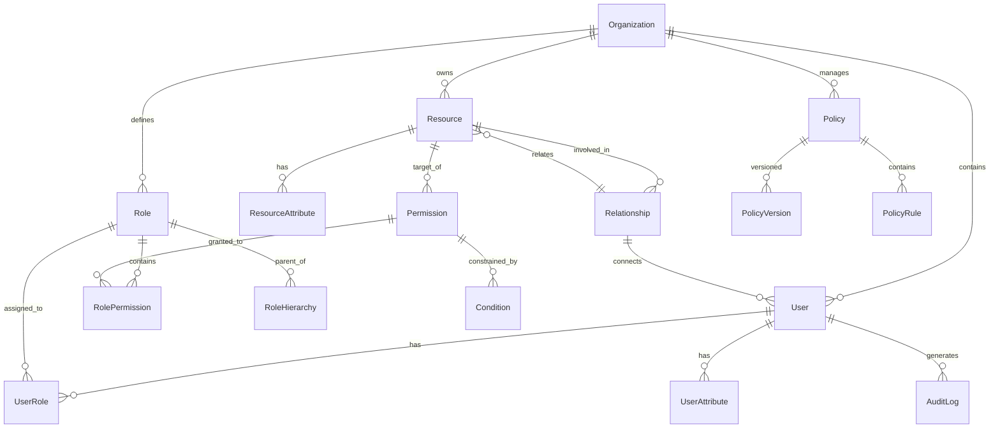

# データモデル設計書 - 認可基盤プラットフォーム

## 1. 概要

### 1.1 目的
本設計書は、認可基盤プラットフォームのデータモデルを定義し、エンティティ間の関係性、データの永続化戦略、パフォーマンス最適化方針を文書化する。

### 1.2 設計方針
- **マイクロサービス原則**: 各サービスが独自のデータストアを保持（Database per Service）
- **イベントソーシング**: 重要な状態変更はイベントとして記録
- **CQRS**: 読み取りと書き込みの分離による最適化
- **最終的一貫性**: サービス間のデータは最終的に一貫性を保証

## 2. 論理データモデル

### 2.1 コアドメインモデル



### 2.2 エンティティ詳細

#### Organization（組織/テナント）
```sql
CREATE TABLE organizations (
    id UUID PRIMARY KEY DEFAULT gen_random_uuid(),
    name VARCHAR(255) NOT NULL,
    domain VARCHAR(255) UNIQUE,
    settings JSONB DEFAULT '{}',
    subscription_plan VARCHAR(50) DEFAULT 'free',
    max_users INTEGER DEFAULT 100,
    max_policies INTEGER DEFAULT 10,
    created_at TIMESTAMP WITH TIME ZONE DEFAULT CURRENT_TIMESTAMP,
    updated_at TIMESTAMP WITH TIME ZONE DEFAULT CURRENT_TIMESTAMP,
    deleted_at TIMESTAMP WITH TIME ZONE,
    CONSTRAINT valid_domain CHECK (domain ~ '^[a-z0-9-]+$')
);

CREATE INDEX idx_org_domain ON organizations(domain);
CREATE INDEX idx_org_deleted_at ON organizations(deleted_at);
```

#### User（ユーザー）
```sql
CREATE TABLE users (
    id UUID PRIMARY KEY DEFAULT gen_random_uuid(),
    organization_id UUID NOT NULL REFERENCES organizations(id),
    external_id VARCHAR(255),  -- IdPのユーザーID
    email VARCHAR(255) NOT NULL,
    username VARCHAR(100),
    full_name VARCHAR(255),
    attributes JSONB DEFAULT '{}',
    last_login_at TIMESTAMP WITH TIME ZONE,
    status VARCHAR(20) DEFAULT 'active',
    created_at TIMESTAMP WITH TIME ZONE DEFAULT CURRENT_TIMESTAMP,
    updated_at TIMESTAMP WITH TIME ZONE DEFAULT CURRENT_TIMESTAMP,
    deleted_at TIMESTAMP WITH TIME ZONE,
    UNIQUE(organization_id, email),
    UNIQUE(organization_id, external_id)
);

CREATE INDEX idx_user_org_email ON users(organization_id, email);
CREATE INDEX idx_user_external_id ON users(external_id);
CREATE INDEX idx_user_attributes_gin ON users USING gin(attributes);
```

#### Role（ロール）
```sql
CREATE TABLE roles (
    id UUID PRIMARY KEY DEFAULT gen_random_uuid(),
    organization_id UUID NOT NULL REFERENCES organizations(id),
    name VARCHAR(100) NOT NULL,
    description TEXT,
    is_system BOOLEAN DEFAULT false,  -- システム定義ロール
    priority INTEGER DEFAULT 0,  -- 優先順位（競合解決用）
    metadata JSONB DEFAULT '{}',
    created_at TIMESTAMP WITH TIME ZONE DEFAULT CURRENT_TIMESTAMP,
    updated_at TIMESTAMP WITH TIME ZONE DEFAULT CURRENT_TIMESTAMP,
    UNIQUE(organization_id, name)
);

CREATE INDEX idx_role_org_name ON roles(organization_id, name);
```

#### Policy（ポリシー）
```sql
CREATE TABLE policies (
    id UUID PRIMARY KEY DEFAULT gen_random_uuid(),
    organization_id UUID NOT NULL REFERENCES organizations(id),
    name VARCHAR(255) NOT NULL,
    type VARCHAR(20) NOT NULL, -- 'RBAC', 'ABAC', 'ReBAC'
    status VARCHAR(20) DEFAULT 'draft', -- 'draft', 'active', 'archived'
    current_version_id UUID,
    created_by UUID REFERENCES users(id),
    created_at TIMESTAMP WITH TIME ZONE DEFAULT CURRENT_TIMESTAMP,
    updated_at TIMESTAMP WITH TIME ZONE DEFAULT CURRENT_TIMESTAMP,
    UNIQUE(organization_id, name),
    CONSTRAINT valid_policy_type CHECK (type IN ('RBAC', 'ABAC', 'ReBAC'))
);

CREATE INDEX idx_policy_org_status ON policies(organization_id, status);
CREATE INDEX idx_policy_type ON policies(type);
```

#### PolicyVersion（ポリシーバージョン）
```sql
CREATE TABLE policy_versions (
    id UUID PRIMARY KEY DEFAULT gen_random_uuid(),
    policy_id UUID NOT NULL REFERENCES policies(id),
    version_number INTEGER NOT NULL,
    content TEXT NOT NULL,  -- Rego/Cedar code
    compiled_content BYTEA,  -- コンパイル済みポリシー
    language VARCHAR(20) NOT NULL, -- 'rego', 'cedar'
    hash VARCHAR(64) NOT NULL,  -- SHA-256
    published_at TIMESTAMP WITH TIME ZONE,
    published_by UUID REFERENCES users(id),
    created_at TIMESTAMP WITH TIME ZONE DEFAULT CURRENT_TIMESTAMP,
    UNIQUE(policy_id, version_number)
);

CREATE INDEX idx_policy_version_policy_version ON policy_versions(policy_id, version_number);
```

#### Resource（リソース）
```sql
CREATE TABLE resources (
    id UUID PRIMARY KEY DEFAULT gen_random_uuid(),
    organization_id UUID NOT NULL REFERENCES organizations(id),
    type VARCHAR(100) NOT NULL,
    name VARCHAR(255) NOT NULL,
    parent_id UUID REFERENCES resources(id),
    owner_id UUID REFERENCES users(id),
    attributes JSONB DEFAULT '{}',
    created_at TIMESTAMP WITH TIME ZONE DEFAULT CURRENT_TIMESTAMP,
    updated_at TIMESTAMP WITH TIME ZONE DEFAULT CURRENT_TIMESTAMP
);

CREATE INDEX idx_resource_org_type ON resources(organization_id, type);
CREATE INDEX idx_resource_parent ON resources(parent_id);
CREATE INDEX idx_resource_owner ON resources(owner_id);
```

#### Permission（権限）
```sql
CREATE TABLE permissions (
    id UUID PRIMARY KEY DEFAULT gen_random_uuid(),
    organization_id UUID NOT NULL REFERENCES organizations(id),
    action VARCHAR(100) NOT NULL,
    resource_type VARCHAR(100) NOT NULL,
    description TEXT,
    created_at TIMESTAMP WITH TIME ZONE DEFAULT CURRENT_TIMESTAMP,
    UNIQUE(organization_id, action, resource_type)
);

CREATE INDEX idx_permission_org_action ON permissions(organization_id, action);
```

#### UserRole（ユーザー・ロール割り当て）
```sql
CREATE TABLE user_roles (
    id UUID PRIMARY KEY DEFAULT gen_random_uuid(),
    user_id UUID NOT NULL REFERENCES users(id),
    role_id UUID NOT NULL REFERENCES roles(id),
    resource_id UUID REFERENCES resources(id),  -- リソース固有のロール
    granted_by UUID REFERENCES users(id),
    granted_at TIMESTAMP WITH TIME ZONE DEFAULT CURRENT_TIMESTAMP,
    expires_at TIMESTAMP WITH TIME ZONE,  -- 期限付き割り当て
    UNIQUE(user_id, role_id, resource_id)
);

CREATE INDEX idx_user_role_user ON user_roles(user_id);
CREATE INDEX idx_user_role_role ON user_roles(role_id);
CREATE INDEX idx_user_role_expires ON user_roles(expires_at) WHERE expires_at IS NOT NULL;
```

#### Relationship（関係性 - ReBAC用）
```sql
CREATE TABLE relationships (
    id UUID PRIMARY KEY DEFAULT gen_random_uuid(),
    organization_id UUID NOT NULL REFERENCES organizations(id),
    subject_type VARCHAR(50) NOT NULL,  -- 'user', 'group', 'resource'
    subject_id UUID NOT NULL,
    relation VARCHAR(50) NOT NULL,  -- 'owner', 'editor', 'viewer', 'parent', etc.
    object_type VARCHAR(50) NOT NULL,
    object_id UUID NOT NULL,
    created_by UUID REFERENCES users(id),
    created_at TIMESTAMP WITH TIME ZONE DEFAULT CURRENT_TIMESTAMP,
    UNIQUE(organization_id, subject_type, subject_id, relation, object_type, object_id)
);

CREATE INDEX idx_relationship_subject ON relationships(subject_type, subject_id);
CREATE INDEX idx_relationship_object ON relationships(object_type, object_id);
CREATE INDEX idx_relationship_relation ON relationships(relation);
```

## 3. 監査・分析データモデル

### 3.1 AuditLog（監査ログ）
```sql
-- TimescaleDB Hypertable
CREATE TABLE audit_logs (
    id UUID DEFAULT gen_random_uuid(),
    timestamp TIMESTAMP WITH TIME ZONE NOT NULL DEFAULT CURRENT_TIMESTAMP,
    organization_id UUID NOT NULL,
    user_id UUID,
    session_id VARCHAR(100),
    action VARCHAR(100) NOT NULL,
    resource_type VARCHAR(100),
    resource_id VARCHAR(255),
    decision VARCHAR(20) NOT NULL,  -- 'allow', 'deny'
    decision_reason TEXT,
    policy_id UUID,
    request_metadata JSONB,  -- IPアドレス、User-Agent等
    response_time_ms INTEGER,
    PRIMARY KEY (timestamp, id)
);

-- TimescaleDB設定
SELECT create_hypertable('audit_logs', 'timestamp', chunk_time_interval => INTERVAL '1 day');

-- インデックス
CREATE INDEX idx_audit_log_org_time ON audit_logs(organization_id, timestamp DESC);
CREATE INDEX idx_audit_log_user_time ON audit_logs(user_id, timestamp DESC);
CREATE INDEX idx_audit_log_decision ON audit_logs(decision);
```

### 3.2 Metrics（メトリクス）
```sql
-- 集計済みメトリクス
CREATE TABLE authorization_metrics (
    time_bucket TIMESTAMP WITH TIME ZONE NOT NULL,
    organization_id UUID NOT NULL,
    metric_type VARCHAR(50) NOT NULL,  -- 'request_count', 'latency_p95', etc.
    dimension_key VARCHAR(100),  -- 'user', 'policy', 'resource_type'等
    dimension_value VARCHAR(255),
    value NUMERIC NOT NULL,
    PRIMARY KEY (time_bucket, organization_id, metric_type, dimension_key, dimension_value)
);

SELECT create_hypertable('authorization_metrics', 'time_bucket', chunk_time_interval => INTERVAL '1 hour');
```

## 4. キャッシュデータ構造（Redis）

### 4.1 認可決定キャッシュ
```javascript
// Key pattern: auth:{org_id}:{user_id}:{action}:{resource_type}:{resource_id}
// Value: JSON
{
    "decision": "allow",
    "reason": "User has admin role",
    "policy_ids": ["policy-123", "policy-456"],
    "ttl": 300,  // 5分
    "cached_at": "2025-10-25T10:30:00Z"
}
```

### 4.2 ポリシーキャッシュ
```javascript
// Key pattern: policy:{org_id}:{policy_id}:{version}
// Value: Compiled policy (binary)
```

### 4.3 ユーザーロールキャッシュ
```javascript
// Key pattern: user_roles:{org_id}:{user_id}
// Value: Set of role IDs
["role-admin", "role-developer", "role-viewer"]
```

### 4.4 セッションストア
```javascript
// Key pattern: session:{session_id}
// Value: JSON
{
    "user_id": "user-123",
    "organization_id": "org-456",
    "roles": ["admin", "developer"],
    "attributes": {
        "department": "engineering",
        "location": "tokyo"
    },
    "created_at": "2025-10-25T10:00:00Z",
    "expires_at": "2025-10-25T18:00:00Z"
}
```

## 5. イベントストア（Kafka）

### 5.1 イベントスキーマ
```json
{
    "event_id": "uuid",
    "event_type": "PolicyUpdated",
    "timestamp": "2025-10-25T10:30:00Z",
    "organization_id": "org-123",
    "aggregate_id": "policy-456",
    "aggregate_type": "Policy",
    "user_id": "user-789",
    "payload": {
        // イベント固有のデータ
    },
    "metadata": {
        "correlation_id": "req-123",
        "causation_id": "evt-456"
    }
}
```

### 5.2 主要イベント
- PolicyCreated / PolicyUpdated / PolicyDeleted
- UserCreated / UserUpdated / UserDeleted
- RoleAssigned / RoleRevoked
- ResourceCreated / ResourceDeleted
- PermissionGranted / PermissionRevoked
- RelationshipEstablished / RelationshipRemoved

## 6. データ分割戦略

### 6.1 サービス別データ配置

| サービス | 主要テーブル | データストア |
|---------|------------|-------------|
| Identity Service | users, user_attributes | PostgreSQL |
| Policy Service | policies, policy_versions | PostgreSQL |
| Authorization Service | permissions, user_roles | PostgreSQL + Redis |
| Relationship Service | relationships | PostgreSQL (将来的にNeo4j) |
| Audit Service | audit_logs | TimescaleDB |
| Analytics Service | authorization_metrics | TimescaleDB |

### 6.2 シャーディング戦略
- **組織ID別シャーディング**: 大規模環境では organization_id でシャーディング
- **時系列データのパーティショニング**: 監査ログは日次、メトリクスは時間単位
- **読み取りレプリカ**: 読み取り負荷分散のためのレプリカ配置

## 7. パフォーマンス最適化

### 7.1 インデックス戦略
- 検索頻度の高いカラムには必ずインデックスを作成
- 複合インデックスは検索パターンに基づいて設計
- JSONBフィールドにはGINインデックスを使用
- 部分インデックスで削除済みデータを除外

### 7.2 キャッシュ戦略
- **L1キャッシュ**: アプリケーション内メモリ（10秒）
- **L2キャッシュ**: Redis（5分）
- **キャッシュ無効化**: イベント駆動による即座の無効化

### 7.3 クエリ最適化
- N+1問題の回避（JOINまたはバッチ取得）
- 必要なカラムのみ取得（SELECT * を避ける）
- ページネーション（カーソルベース）
- 非同期処理とバッチ処理の活用

## 8. データマイグレーション

### 8.1 スキーマバージョン管理
- Flyway/Liquibaseによるマイグレーション管理
- 前方互換性を保つ段階的なスキーマ変更
- ロールバック可能な変更の実装

### 8.2 ゼロダウンタイムマイグレーション
1. 新カラムの追加（NULL許可）
2. アプリケーションの更新（新旧両対応）
3. データ移行バッチの実行
4. 新カラムのNOT NULL化
5. 旧カラムの削除

## 9. バックアップとリカバリ

### 9.1 バックアップ戦略
- **フルバックアップ**: 日次（深夜）
- **差分バックアップ**: 6時間ごと
- **WALアーカイブ**: 継続的
- **保持期間**: 30日間（コンプライアンス要件により延長可能）

### 9.2 リカバリ手順
- **RPO（Recovery Point Objective）**: 1分
- **RTO（Recovery Time Objective）**: 1時間
- **PITR（Point-In-Time Recovery）**: 対応

## 10. データガバナンス

### 10.1 データ分類
- **機密データ**: パスワード、APIキー（暗号化必須）
- **個人情報**: メールアドレス、氏名（GDPR/個人情報保護法対応）
- **業務データ**: ロール、権限、ポリシー
- **公開データ**: メトリクス（集計済み）

### 10.2 データライフサイクル
- **アクティブ期間**: オンラインストレージ（高速アクセス）
- **アーカイブ期間**: コールドストレージ（S3 Glacier）
- **削除**: 論理削除後、規定期間後に物理削除

---

**文書情報**
- バージョン: 1.0.0
- 作成日: 2025-10-25
- 作成者: System Architect Agent
- レビュー状態: ドラフト
- 関連文書: architecture_design.md
